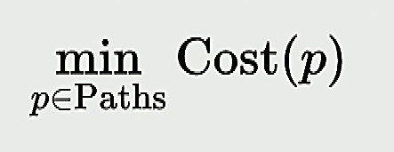
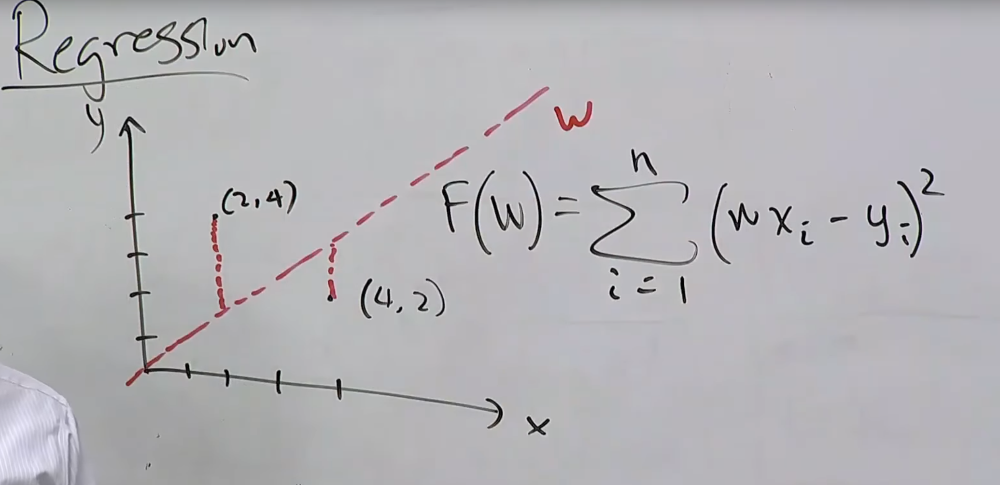

- What are the two types of optimizations we can use?
	- Discrete optimization: find the best discrete object
		- {:height 63, :width 138}
		- Algorythimc tool: dynamic programming
	- Continuous optimization: find the best vector of real numbers
		- {:height 72, :width 212}
		- Algorythmic tool: gradient descent
- Regression sum
	- 
	- we have a function (the red line which is F(w)) and test values (2,4)(4,2).
	- we go ahead an check the difference in outcome of the test values in comparison to our function
		- example: f(2) = 2, testvalues(2) = 4. So 2 - 4 = -2. -2 is the the error value here
	- now we go ahead an square it so we only have positive numbers. This is easier to work with.
- ## Principle: Reduce the problem
- Find the possible actions that can be performed
- Find the costs of each problem
- use caches to save known subsolutions
	- with cache we pay for the number or nodes not the number of paths
- abstract away the details